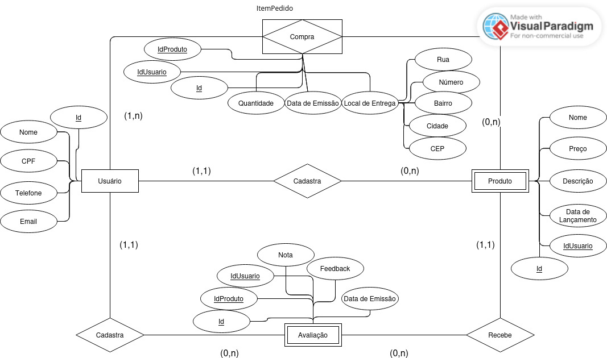
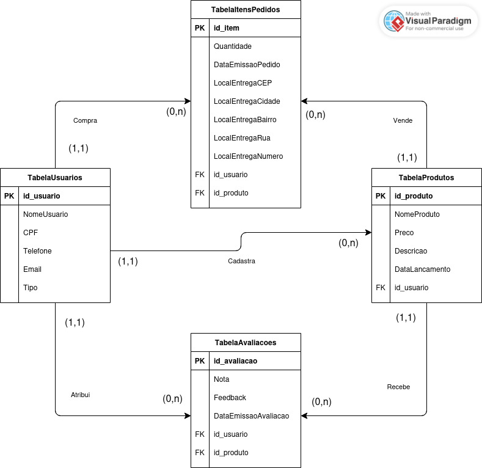

# Projeto de API de Sistema de Gerenciamento de Pedidos para Entrega de Depósito

## Dados do projeto

- **Linguagem:** Java versão 17
- **Framework:** Spring Boot 3.3.4
- **Gerenciador de Dependências:** Maven
- **Nome:** deposito.api
- **Descrição:** API Rest da aplicação Gerenciamento de Pedidos para Entrega de Depósito
- **SGBD:** MySQL

## Levantamento de requisitos

Um depósito solicita a criação de uma aplicação que auxilie no gerenciamento de um sistema de pedidos para entrega. O objetivo é que a aplicação tenha o poder de: (1) cadastrar clientes e funcionários, coletando seus dados pessoais; (2) cadastrar produtos, informando detalhes do produto e preço; (3) cadastrar pedidos, informando cliente que fez o pedido, produtos que o cliente está comprando e local de entrega onde o cliente ira receber o produto; e (4) um sistema de ouvidoria para que os clientes possam avaliar os produtos que estão sendo fornecidos.

## Modelagem de dados - Modelo Conceitual

## Modelagem de dados - Modelo Lógico

## Projeto de Qualidade de Dados

Para garantir a qualidade dos dados a aplicação deve oferecer:
- Limpeza e transformação dos dados;
- Validação de dados em relação a regras de negócio e padrões definidos;
- Detecção e correção de erros;
- Padronização dos dados.

## Projeto de Segurança de Dados

Para garantir segurança contra acesso e/ou modificação não autorizados são implementadas medidas de:
- Criptografia de senhas;
- Políticas de privacidade;
- Políticas de acesso.

## Etapas do projeto

### 1. Criação do projeto Spring Boot

A criação do projeto Spring Boot consiste na instalação de dependências essenciais e configuração de conexão com banco de dados MySQL. No decorrer do projeto, conforme o surgimento da necessidade de instalação de dependências adicionais, o projeto Spring Boot permite que essas dependências sejam adicionadas de forma simples e rápida.

### 2. Criação do sistema de cadastro de produtos

A criação do sistema de cadastro de produtos será feito por meio dos endpoints “/usuarios” e “/produtos”. Os endpoints “/usuarios” terão o objetivo de oferecer um sistema de cadastro e autenticação com dois tipos de usuário: (a) O usuário comum, que tem permissão para visualizar os produtos cadastrados; e (b) o usuário administrador que, além da permissão para visualizar os produtos cadastrados, também tem permissão para cadastrar produtos. Já os endpoints “/produtos”, tem as funções de cadastro e visualização de produtos, associado a um sistema de gerenciamento de permissões.

### 3. Criação do sistema de pedidos

A criação do sistema de pedidos será baseada no gerenciamento dos endpoits “/pedidos” por meio de uma classe service que associa as entidades Cliente e Produto. O sistema de gerenciamento de permissões dos pedidos dá permissão para os usuários comuns emitam pedidos de qualquer ordem, mas não dá permissão para que um usuário comum visualize os pedidos de outros usuários. Além do sistema de gerenciamento de permissões a classe service fica responsável pela implementação das regras de negócio.

### 4. Criação do sistema de ouvidoria

A criação do sistema de ouvidoria será feito por meio dos endpoints “/avaliacoes”. O sistema de gerenciamento de permissões dos endpoints “/avaliacoes” dá permissão para que os usuários comuns emitam avaliações dos produtos que fizeram pedido, mas somente os usuários administradores podem visualizar o resultado das avaliações. Além do sistema de gerenciamento de permissões, os endpoints de avaliações utilizam uma classe service que fica responsável pela implementação das regras de negócio.
