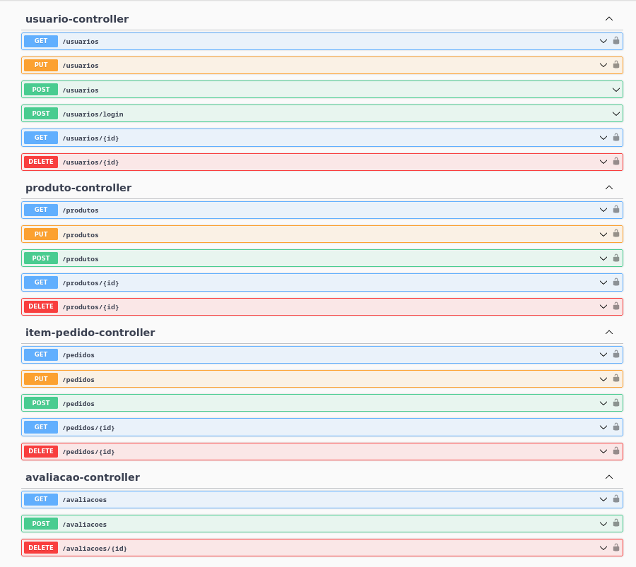
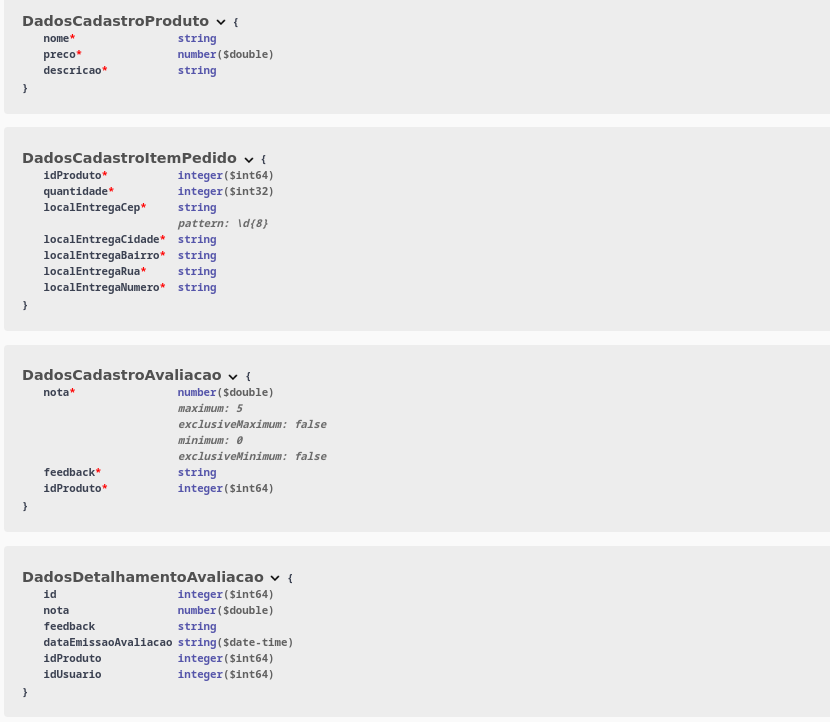
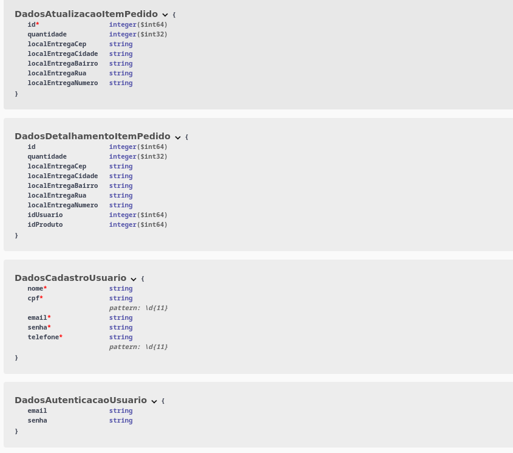
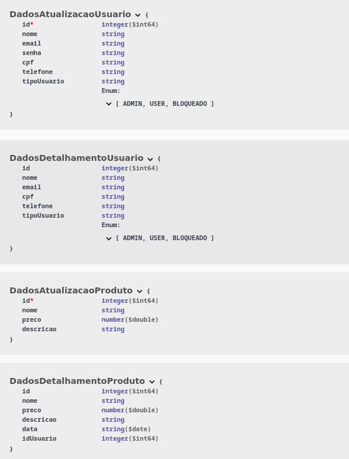

# Projeto de API de Sistema de Gerenciamento de Pedidos para Entrega de Depósito

## Dados do projeto

- **Linguagem:** Java versão 17
- **Framework:** Spring Boot 3.3.4
- **Gerenciador de Dependências:** Maven
- **Nome:** deposito.api
- **Descrição:** API Rest da aplicação Gerenciamento de Pedidos para Entrega de Depósito
- **SGBD:** MySQL

## Levantamento de requisitos

Um depósito solicita a criação de uma aplicação que auxilie no gerenciamento de um sistema de pedidos para entrega. O objetivo é que a aplicação tenha o poder de: (1) cadastrar clientes e funcionários, coletando seus dados pessoais; (2) cadastrar produtos, informando detalhes do produto e preço; (3) cadastrar pedidos, informando cliente que fez o pedido, produtos que o cliente está comprando e local de entrega onde o cliente ira receber o produto; e (4) um sistema de ouvidoria para que os clientes possam avaliar os produtos que estão sendo fornecidos.

## Modelagem de dados - Modelo Conceitual

## Modelagem de dados - Modelo Lógico

## Projeto de Qualidade de Dados

Para garantir a qualidade dos dados a aplicação deve oferecer:
- Normalização dos dados
- Limpeza e transformação dos dados;
- Validação de dados em relação a regras de negócio e padrões definidos;
- Detecção e correção de erros;
- Padronização dos dados.

## Projeto de Segurança de Dados

Para garantir segurança contra acesso e/ou modificação não autorizados são implementadas medidas de:
- Encapsulamento de entidades por meio de utilização de classes DTO;
- Criptografia de senhas;
- Políticas de privacidade;
- Políticas de acesso.

## Etapas do projeto

### 1. Criação do projeto Spring Boot

A criação do projeto Spring Boot consiste na instalação de dependências essenciais e configuração de conexão com banco de dados MySQL. No decorrer do projeto, conforme o surgimento da necessidade de instalação de dependências adicionais, o projeto Spring Boot permite que essas dependências sejam adicionadas de forma simples e rápida.

Nesta etapa do projeto foram adicionados ao arquivo src/main/resources/application.properties os ponteiros:
- ${DB_HOST}: Deve apontar para endereço IP do host e a porta onde o SGBD está rodando;
- ${DB_NAME}: Deve apontar para nome do banco de dados que foi criado no SGBD;
- ${DB_USER}: Deve apontar para login do usuário do SGBD;
- ${DB_PASSWORD}: Deve apontar para a senha do usuário do SGBD;
- ${JWT_SECRET}: Deve apontar para a secret key que foi criada para o token service.

Antes de inicializar a API, deve ser criado o banco de dados, usuário do SGBD e essas variáveis de ambiente devem ser adicionadas ao host.

### 2. Criação do sistema de cadastro de produtos

A criação do sistema de cadastro de produtos será feito por meio dos endpoints “/usuarios” e “/produtos”. Os endpoints “/usuarios” terão o objetivo de oferecer um sistema de cadastro e autenticação com dois tipos de usuário: (a) O usuário comum (USER), que tem permissão para visualizar os produtos cadastrados; e (b) o usuário administrador (ADMIN) que, além da permissão para visualizar os produtos cadastrados, também tem permissão para cadastrar produtos. Já os endpoints “/produtos”, tem as funções de cadastro e visualização de produtos, associado a um sistema de gerenciamento de permissões.

Regras de validação:
- Não é permitido cadastrar nenhum tipo de dado nulo ou em branco;
- cpf deve conter 11 dígitos;
- telefone deve conter 11 dígios;
- validação de email.

Serviço de não-repúdio:
- No cadastro e na edição de produtos foi implementado um serviço que captura do token o id do usuário ADMIN que cadastrou ou editou um produto.

Configuração de políticas de acesso e privacidade:
- Qualquer pessoa pode se cadastrar e fazer login sem a necessidade de autenticação;
- No cadastro de usuário todos os usuários são cadastrados inicialmente como USER;
- Usuários autenticados com privilégios de USER ou ADMIN podem visualizar todos os produtos cadastrados;
- Somente usuários autenticados com privilégios de ADMIN podem cadastrar, editar e deletar produtos;
- Somente usuários autenticados com privilégios de ADMIN podem visualizar, editar e deletar usuários.

### 3. Criação do sistema de pedidos

A criação do sistema de pedidos será baseada no endpoits “/pedidos” implementando um relacionamento de muitos para muitos que associa o pedido as entidades Cliente e Produto. O sistema de gerenciamento de permissões dos pedidos dá permissão para que os usuários comuns emitam pedidos de qualquer ordem, mas não dá permissão para que um usuário comum visualize os pedidos de outros usuários.

Regras de validação:
- Não é permitido cadastrar nenhum tipo de dado nulo ou em branco;
- CEP deve conter 8 dígitos.

Serviço de não-repúdio:
- No serviço de cadastro de pedido foi implementado um serviço que captura do token o id do usuário que cadastrou o pedido;
- Caso um usuário ADMIN faça algum tipo de edição no pedido, esse pedido permanece com o id do usuário que fez o pedido.

Configuração de políticas de acesso e privacidade:
- Usuários autenticados com privilégios de USER ou ADMIN podem cadastrar pedidos;
- Somente usuários autenticados com privilégios de ADMIN podem visualizar, editar e deletar pedidos;
- É aberta a exceção para usuários autenticados com privilégios de USER visualizar somente seus próprios pedidos.

### 4. Criação do sistema de ouvidoria

A criação do sistema de ouvidoria será feito por meio dos endpoints “/avaliacoes”. O sistema de gerenciamento de permissões dos endpoints “/avaliacoes” dá permissão para que os usuários comuns emitam avaliações dos produtos que fizeram pedido, mas somente os usuários administradores podem visualizar o resultado das avaliações. Além do sistema de gerenciamento de permissões, os endpoints de avaliações utilizam uma classe service que fica responsável pela implementação das regras de negócio.

Regras de validação:
- Não é permitido cadastrar nenhum tipo de dado nulo ou em branco;
- nota deve ser maior ou igual a 0 e menor ou igual a 5;

Serviço de não-repúdio:
- No serviço de cadastro de pedido foi implementado um serviço que captura do token o id do usuário que cadastrou a avaliação.

Configuração de políticas de acesso e privacidade:
- Usuários autenticados com privilégios de USER ou ADMIN podem cadastrar avaliacoes;
- Somente usuários autenticados com privilégios de ADMIN podem visualizar e deletar avaliacoes.

## Documentação

Disponível no endpoint "/swagger-ui.html"

## Observações

Por meio da  migration V2, a aplicação cria automaticamente um usuário do tipo ADMIN que possui:

- **Login:** admin@deposito.com
- **Senha:** senha123

É sugerido que esse usuário seja utilizado somente para a criação do primeiro usuário pessoal do tipo ADMIN e logo após a criação ele seja excluído.
